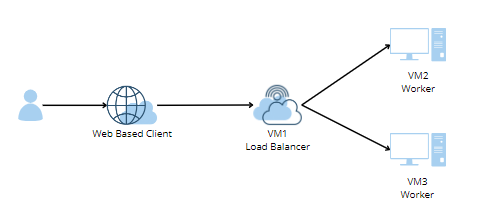
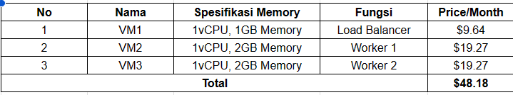

# Cloud Computing Final Project
Kelompok A4
- Nicholas Marco Weinandra - 5027221042
- Imam Nurhadi - 5027221046
- Moch. Zidan Hadipratama - 5027221052
- Alma Almira Dewani - 5027221054


## Problem

Anda adalah seorang lulusan Teknologi Informasi, sebagai ahli IT, salah satu kemampuan yang harus dimiliki adalah **Keampuan merancang, membangun, mengelola aplikasi berbasis komputer menggunakan layanan awan untuk memenuhi kebutuhan organisasi.**(menurut kurikulum IT ITS 2023 😙) 

Pada suatu saat teman anda ingin mengajak anda memulai bisnis di bidang digital marketing, anda diberikan sebuah aplikasi berbasis API File: [app.py](/app.py)


## Endpoints dan Database:
### Endpoints
1. **Get All Orders**
   - **Endpoint:** `GET /orders`
   - **Description:** Retrieve a list of all orders.
   - **Response:**
     ```json
     {
       "orders": [
         {
            "_id": "order_id_1", "product": "Product1", "quantity": 5, "customer_name": "John Doe", "customer_address": "123 Main St"
            },
         {
            "_id": "order_id_2", "product": "Product2", "quantity": 3, "customer_name": "Jane Smith", "customer_address": "456 Oak St"
        },
         // ...
       ]
     }
     ```
2. **Create a New Order**
   - **Endpoint:** `POST /orders`
   - **Description:** Create a new order.
   - **Request:**
     ```json
     {
       "product": "ProductY",
       "quantity": 2,
       "customer_name": "Bob Anderson",
       "customer_address": "101 Pine St"
     }
     ```
   - **Response:**
     ```json
     {
       "message": "Order created successfully",
       "order": {
            "_id": "new_order_id", "product": "ProductY", "quantity": 2, "customer_name": "Bob Anderson", "customer_address": "101 Pine St"
        }
     }
     ```
### Database
 - **Database:** `orders_db`
- **Connection URI:** `mongodb://localhost:27017/orders_db`

Kemudian anda diminta untuk mendesain arsitektur cloud yang sesuai dengan kebutuhan aplikasi tersebut. Apabila dana maksimal yang diberikan adalah 1 juta rupiah per bulan (65 US$) konfigurasi cloud terbaik seperti apa yang bisa dibuat?

## Arsitektur

<br/>Untuk membangun arsitektur tersebut, maka digunakan layanan awan dari Microsoft Azure dengan memanfaatkan free-trial sebesar $200. Rincian spesifikasi VM beserta harganya adalah sebagai berikut:


## Langkah Implementasi

## Hasil Pengujian Endpoint

## Load Testing

## Kesimpulan dan Saran
