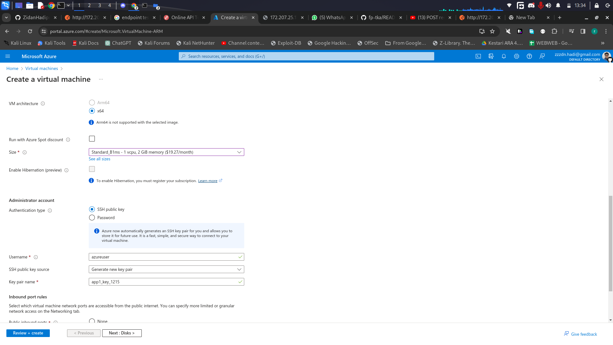
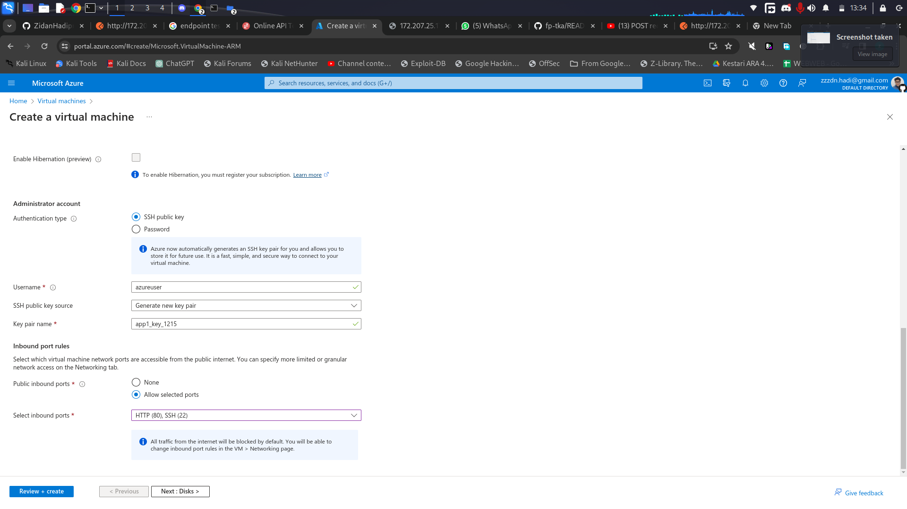

# Cloud Computing Final Project

Kelompok A4

- Nicholas Marco Weinandra - 5027221042
- Imam Nurhadi - 5027221046
- Moch. Zidan Hadipratama - 5027221052
- Alma Almira Dewani - 5027221054

## Problem

Anda adalah seorang lulusan Teknologi Informasi, sebagai ahli IT, salah satu kemampuan yang harus dimiliki adalah **Keampuan merancang, membangun, mengelola aplikasi berbasis komputer menggunakan layanan awan untuk memenuhi kebutuhan organisasi.**(menurut kurikulum IT ITS 2023 😙)

Pada suatu saat teman anda ingin mengajak anda memulai bisnis di bidang digital marketing, anda diberikan sebuah aplikasi berbasis API File: [app.py](/app.py)

## Endpoints dan Database:

### Endpoints

1. **Get All Orders**
   - **Endpoint:** `GET /orders`
   - **Description:** Retrieve a list of all orders.
   - **Response:**
     ```json
     {
       "orders": [
         {
           "_id": "order_id_1",
           "product": "Product1",
           "quantity": 5,
           "customer_name": "John Doe",
           "customer_address": "123 Main St"
         },
         {
           "_id": "order_id_2",
           "product": "Product2",
           "quantity": 3,
           "customer_name": "Jane Smith",
           "customer_address": "456 Oak St"
         }
         // ...
       ]
     }
     ```
2. **Create a New Order**
   - **Endpoint:** `POST /orders`
   - **Description:** Create a new order.
   - **Request:**
     ```json
     {
       "product": "ProductY",
       "quantity": 2,
       "customer_name": "Bob Anderson",
       "customer_address": "101 Pine St"
     }
     ```
   - **Response:**
     ```json
     {
       "message": "Order created successfully",
       "order": {
         "_id": "new_order_id",
         "product": "ProductY",
         "quantity": 2,
         "customer_name": "Bob Anderson",
         "customer_address": "101 Pine St"
       }
     }
     ```

### Database

- **Database:** `orders_db`
- **Connection URI:** `mongodb://localhost:27017/orders_db`

Kemudian anda diminta untuk mendesain arsitektur cloud yang sesuai dengan kebutuhan aplikasi tersebut. Apabila dana maksimal yang diberikan adalah 1 juta rupiah per bulan (65 US$) konfigurasi cloud terbaik seperti apa yang bisa dibuat?

## Arsitektur


<br/>Untuk membangun arsitektur tersebut, maka digunakan layanan awan dari Microsoft Azure dengan memanfaatkan free-trial sebesar $200. Rincian spesifikasi VM beserta harganya adalah sebagai berikut:


## Langkah Implementasi

### Membuat Virtual Machine Aplikasi

1. Membuat Resource Group untuk mengelompokan sumber daya yang akan digunakan. Disini kami memberi nama `FP-TKA`.
2. Membuat Virtual Machine menggunakan Azure dengan konfigurasi sebagai berikut:

   - Menggunakan resource group yang telah dibuat, yaitu `FP-TKA`
   - Menggunakan ubuntu sebagai konfigurasinya
   - Menggunakan `x64` sebagai VM Architecturenya.
   - Memilih size dengan spesifikasi `1 vcpu, 2GiB memory ($19.27/month)`
   - Menggunakan `SSH public key` sebagai authentication type.
   - Memilih untuk `Allow selected port` agar port yang dibuat bisa diakses di internet. Port yang bisa diakses adalah `HTTP (80) dan SSH (22)`.






3. Selanjutnya, klik tombol `next` yang ada di pojok kanan bawah hingga ke halaman terakhir.
4. Jika sudah di halaman terakhir dan tidak terjadi error, klik tombol `review + create` yang ada di pojok kiri bawah.
5. Terakhir, tunggu virtual machine yang telah kita buat di deploy oleh azure.

### Membuat Virtual Machine Load Balancer

1. Membuat Resource Group untuk mengelompokan sumber daya yang akan digunakan. Disini kami memberi nama `FP-TKA`.
2. Selanjutnya, membuat VM dengan Konfigurasi sebagai berikut:

   - Menggunakan resource group yang telah dibuat, yaitu `FP-TKA`.
   - Menggunakan Nginx sebagai konfigurasinya.
   - Menggunakan `x64` sebagai VM Architecturenya.
   - Memilih size dengan spesifikasi `1 vcpu, 1GiB memory ($9.64/month)`.
   - Menggunakan `SSH public key` sebagai authentication type.


3. Selanjutnya, klik tombol `next` yang ada di pojok kanan bawah hingga ke halaman terakhir.
4. Jika sudah di halaman terakhir dan tidak terjadi error, klik tombol `review + create` yang ada di pojok kiri bawah.
5. Terakhir, tunggu virtual machine yang telah kita buat di deploy oleh azure.

### Konfigurasi VM Aplikasi dan Load Balancer

#### Konfigurasi VM Aplikasi

Untuk konfigurasi VM Worker, pertama harus menginstall beberapa app dependencies sebagai berikut:

```bash
sudo apt-get install nginx
sudo apt-get install python3
sudo apt install python3-pip
pip install Flask Flask-PyMongo
pip install pymongo
pip install gunicorn
```

Setelah itu, kita membuat directory baru bernama `local`

```bash
mkdir local
```

Setelah itu, pengguna harus berpindah ke PC Operator dan melakukan konfigurasi 2 worker VM menggunakan command berikut:

```bash
# Untuk vm app1
# Kirim file app.py dan app di app1
scp -i linux.pem app.py azureuser@20.211.49.205:~/local/app.py
scp -i linux.pem app azureuser@20.211.49.205:~/local/default

# Untuk VM app2
# Kirim file app.py dan app di app2
scp -i app2_key.pem app.py azureuser@20.5.224.152:~/local/app.py
scp -i app2_key.pem app azureuser@20.5.224.152:~/local/default
```

Kemudian user harus berpindah ke VM aplikasi dan meng-install mongodb dan mongosh

```bash
# install mongodb
sudo apt-get install gnupg curl
curl -fsSL https://pgp.mongodb.com/server-7.0.asc | \
   sudo gpg -o /usr/share/keyrings/mongodb-server-7.0.gpg \
   --dearmor
echo "deb [ arch=amd64,arm64 signed-by=/usr/share/keyrings/mongodb-server-7.0.gpg ] https://repo.mongodb.org/apt/ubuntu jammy/mongodb-org/7.0 multiverse" | sudo tee /etc/apt/sources.list.d/mongodb-org-7.0.list
sudo apt-get update
sudo apt-get install -y mongodb-org

# install mongosh
echo "deb [ arch=amd64,arm64 ] https://repo.mongodb.org/apt/ubuntu jammy/mongodb-org/7.0 multiverse" | sudo tee /etc/apt/sources.list.d/mongodb-org-7.0.list
sudo apt-get update
sudo apt-get install -y mongodb-mongosh
```

Langkah selanjutnya adalah men-copy konfigurasi nginx dan cek nginx menggunakan:

```bash
# Copy configurasi nginx
sudo cd ~/local
sudo cp default /etc/nginx/sites-available/default

# Cek nginx
sudo nginx -t
```
Kemudian pengguna melakukan setup database untuk masing-masing VM. Pertama pengguna menjalankan command berikut:

```bash
sudo systemctl start mongod
```
Kemudian pengguna masuk ke shell mongo dengan menjalankan:
```bash
mongosh
```
Kemudian dalam mongosh, pengguna menjalankan

```bash
use orders-db
db.createCollection("orders")
```


### Konfigurasi Load Balancer
Pertama, buat directory `local`

```bash
mkdir local
```

Kemudian berpindah dari app VM Load Balancer ke PC Operator untuk menjalankan command berikut:

```bash
# Kirim file nginx.conf ke nginx load balancer
scp -i linuxLoad.pem nginx.conf azureuser@172.207.25.178:~/local/default
```

Kemudian pindah dari PC Operator ke VM Load Balancer dan set konfigurasi load balancer.

```bash
sudo cd ~/local # pergi ke folder local tempatnya file2 dr pc operator
sudo cp default /etc/nginx/sites-available/default # jalanin command ini untuk set konfigurasi load balancer
```

## Hasil Pengujian Endpoint

Create New Order:


Get Specific Order By ID:


Get All Orders:


Update Order By ID:


Delete By ID:


## Load Testing
Berikut adalah spreadsheet hasil percobaan Load Testing menggunakan Locust:

Spreadsheet lengkapnya dapat diakses di:
https://docs.google.com/spreadsheets/d/1YDEJGyErlGYz20uCw6dCNe4Wu2efgEW7ZK4hPFF_LTA/edit#gid=50051680
## Kesimpulan dan Saran

### Kesimpulan

- Berhasil membuat VM dengan harga di bawah budget dan berjalan dengan baik.
- Biaya lebih murah karna resouse menyesuaikan dengan kebutuhan request

### Saran

Saat ini database untuk aplikasi ini di jalankan di dalam VM masing-masing. Hal ini menyebabkan ketidak sinkronan antar ke dua VM aplikasi.

Sehingga ketika melakukan GET /orders kadangkala data yang didapatkan adalah data dari VM 1 dan kadangkala data yang didapatkan juga di VM 2. Hal ini juga berefek untuk fitur-fitur lainnya, seperti ketika melakukan POST, maka ada kemungkinan data disimpan di VM 1 atau VM 2.

Maka kedepannya, ada baiknya diciptakan VM database yang khusus untuk menampung berbagai data aplikasi. Sehingga aplikasi memiliki 1 lokasi yang sama untuk mengambil dan mengedit data.
